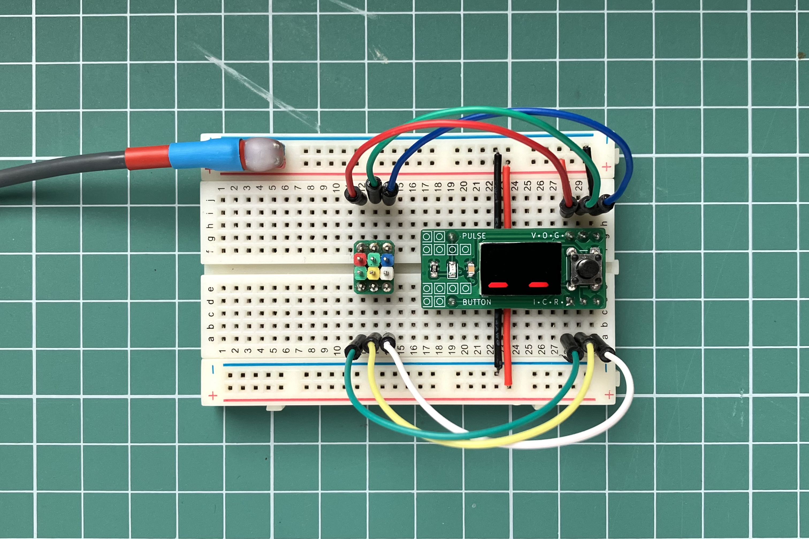
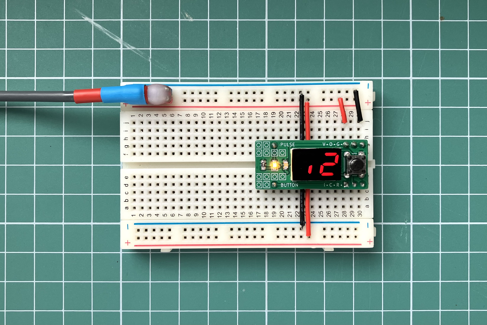

Breadboard Clock Pulse Generator with manual and automatic operating modes.
In manual mode the circuit operates as a debounced button. In automatic mode
it operates as a square wave generator. You could bear through a preset list
of frequencies in a range from 0.1 Hz to 97 Hz.

# Terminal

To check ATtiny24 fuses (and the MCU reaction) you could use `avrdude`.

```sh
$ avrdude -p t24 -c usbasp
```

Brandnew ATtiny24 _20SSU_ responses `Fuses OK (E:FF, H:DC, L:E2)`,
_20PU_ – `Fuses OK (E:FF, H:DF, L:62)`.

Preset fuses:

```sh
$ avrdude -p t24 -c usbasp -U lfuse:w:0xE2:m -U hfuse:w:0xDD:m -U efuse:w:0xFE:m
```

# Arduino IDE

Choose the proper MCU:

Tools > Board > DIY ATtiny > ATtiny24

Choose the compilation settings

Tools >

* Use Bootloader: "No (ISP Programmer Upload)"
* Processor Speed: "8MHz Internal Oscillator"
* Millis, Tone Support: "Millis Available, No Tone"
* Millis Accuracy: "Better Or Equal 0.1% Error (Highest Code Use)"
* Processor Version: "ATtiny24"
* Programmer: "DIY ATTiny: USBasp"

Upload sketch through ICSP connector using USBasp programmer:

Sketch > Upload Using Programmer



# Operating Manual

Use double click to change operating mode. In both modes an LED indicates a
voltage level on the PULSE pin.

### Manual mode

In manual mode the device operates as a debounced button. The seven segment
display indicates a voltage level on the PULSE pin (like an oscilloscope).

### Automatic Pulse Mode

In automatic pulse mode the display indicates a current pulse frequency.
You could bear though frequencies with a long button click.


